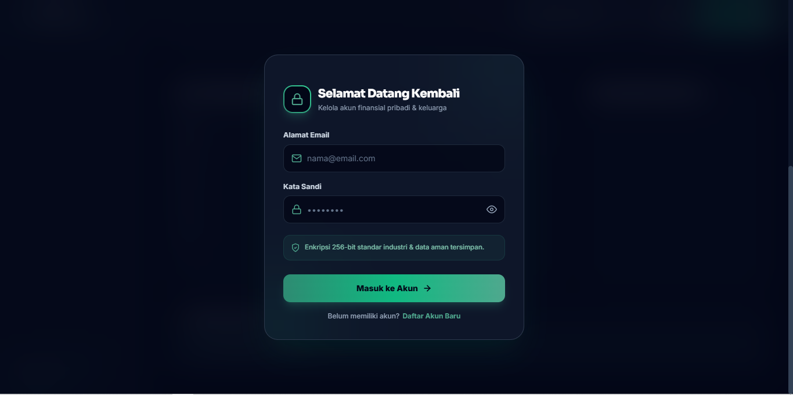
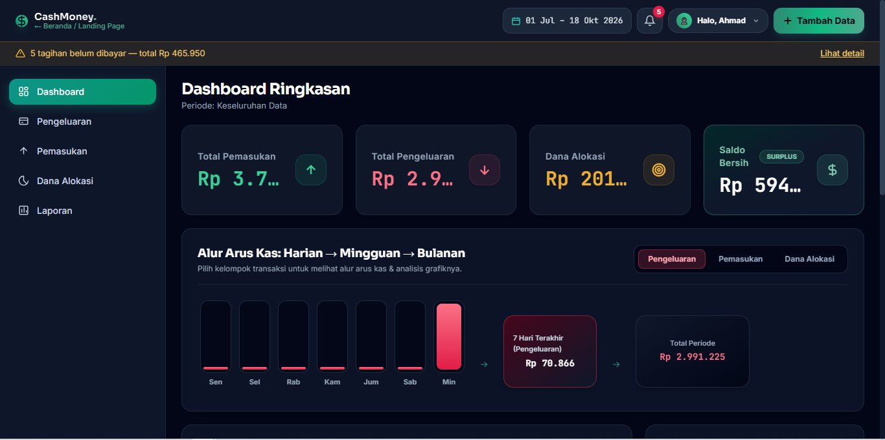
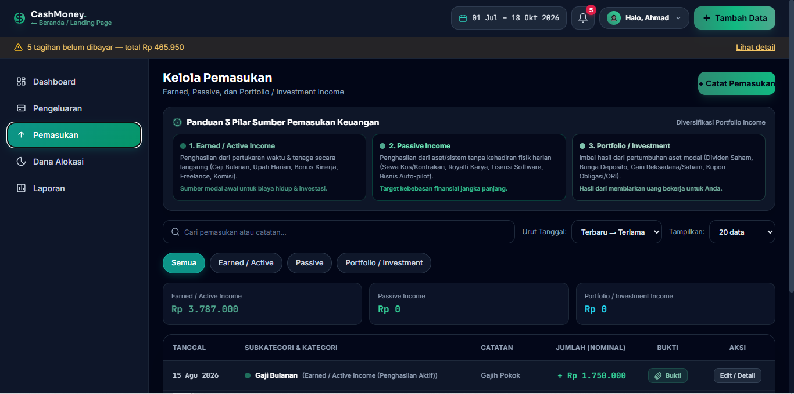
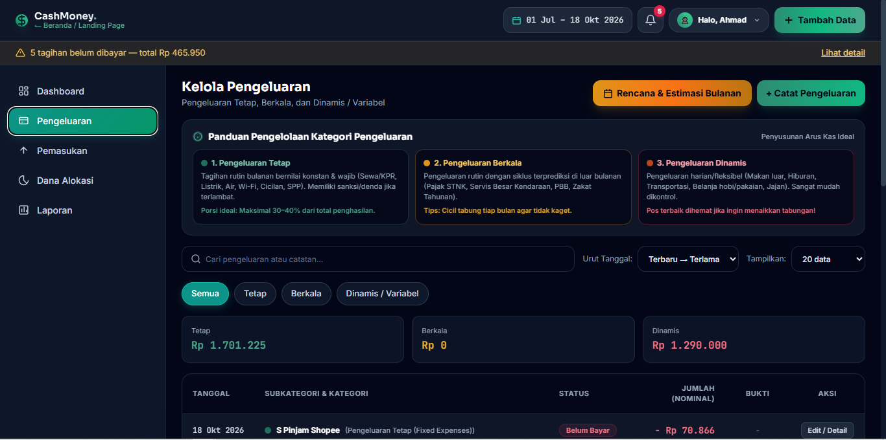
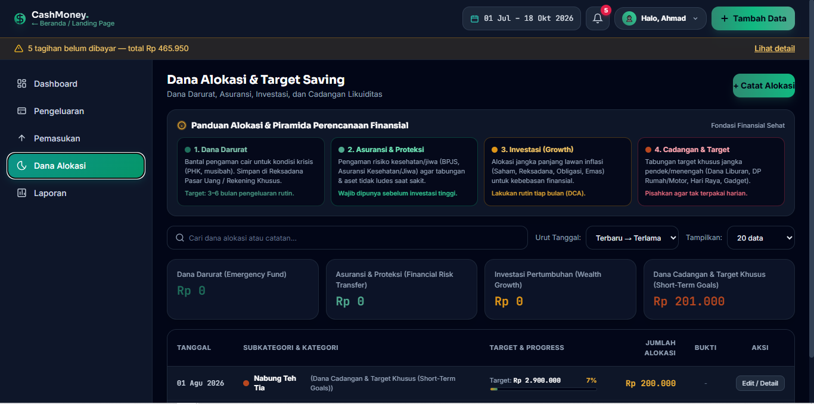
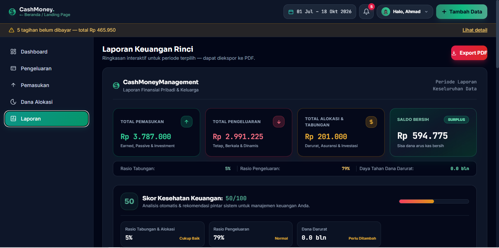
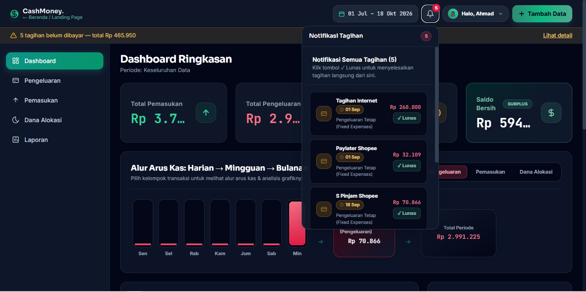

# 💸 CashMoney Management — Frontend Application

[](LICENSE)
[](https://nextjs.org/)
[](https://react.dev/)
[](https://tailwindcss.com/)

.png)

**CashMoney Management** adalah platform manajemen keuangan modern dan profesional yang dirancang untuk membantu pengguna melacak, merencanakan, dan menganalisis arus kas (*cash flow*) dengan cerdas. Dibangun menggunakan **Next.js 14 App Router**, **Tailwind CSS**, serta terintegrasi langsung dengan Express.js REST API dan Supabase.

---

## 🌟 Fitur Utama & Tampilan Antarmuka

### 1. Landing Page & Kalkulator Interaktif
Menyajikan informasi produk secara visual dan elegan, dilengkapi kalkulator keuangan interaktif untuk estimasi awal sebelum pendaftaran.
<p align="center">
  
  
</p>

### 2. Autentikasi & Proteksi Sesi Pengguna
Sistem otentikasi aman berbasis JWT (JSON Web Token) dengan skema *Protected Routes* dan manajemen sesi terenkripsi.


### 3. Dashboard Analitik & Visualisasi
Ringkasan finansial interaktif yang menampilkan total pemasukan, pengeluaran, saldo bersih, serta grafik distribusi transaksi menggunakan Chart.js.


### 4. Manajemen Transaksi (Pemasukan & Pengeluaran)
Pencatatan transaksi terperinci dengan filter tanggal, kategori dinamis, dan fitur unggahan bukti pembayaran (*receipt attachment*).
<p align="center">
  
  
</p>
<p align="center">
  
  
</p>

### 5. Perencanaan & Estimasi Pengeluaran Bulanan
Fitur kalkulasi proaktif untuk merencanakan pengeluaran mendatang serta menandai transaksi yang sudah dilunasi.
.png)

### 6. Alokasi Dana & Pos Anggaran
Pemisahan dana ke dalam pos-pos anggaran khusus untuk mempermudah kontrol finansial dan pencapaian target tabungan.
<p align="center">
  
  
</p>

### 7. Laporan Mutasi & Cetak Dokumen PDF
Generasi laporan transaksi keuangan yang dapat diekspor langsung ke format PDF menggunakan `html2canvas` dan `jsPDF`.
<p align="center">
  
  
</p>

---

## 🏗️ Arsitektur Frontend & UI/UX Standards (`/frontend`, `/pm`, `/qa`)

Aplikasi frontend dikembangkan mengikuti standar **UI/UX Pro Max Intelligence** dan arsitektur kode berskala tinggi:

1. **Next.js 14 App Router Framework**: Memaksimalkan *Server & Client Components* untuk performa rendering optimal, SEO-friendly, dan pemuatan halaman ultra-cepat.
2. **Mobile-First & Adaptive Layout**: Desain responsif berbasis Tailwind CSS yang menyesuaikan tampilan dengan sempurna di perangkat smartphone, tablet, maupun desktop.
3. **Safe State & Input Validation via Guard Clauses**: Validasi form proaktif sebelum pengiriman HTTP request ke backend untuk mencegah input yang tidak valid dan mengurangi *runtime error*.
4. **Zero Hardcoded Master Data**: Seluruh pilihan kategori dan data statistik diisi secara dinamis melalui konsumsi REST API Backend.
5. **PDF Export & Chart Rendering Engine**: Mengintegrasikan `Chart.js` untuk grafik finansial dan `jspdf` + `html2canvas` untuk pembuatan dokumen laporan mutasi secara instant.

---

## 📁 Struktur Direktori Frontend

```
CashMoneyManagement-Frontend/
├── LICENSE                    # Lisensi Open Source (MIT License - Ahmad Arif)
├── README.md                  # Dokumentasi teknis Frontend
├── package.json               # Dependensi & script eksekusi Next.js
├── next.config.mjs            # Konfigurasi Next.js
├── tailwind.config.js         # Konfigurasi Tema & Design Tokens Tailwind
├── postcss.config.js          # Konfigurasi PostCSS
├── .env.example               # Template variabel lingkungan
├── app/                       # App Router Directory (Pages, Layouts & Components)
│   ├── layout.js              # Root Layout & Global Providers
│   ├── page.js                # Halaman Utama / Landing Page
│   ├── login/                 # Halaman Autentikasi Login
│   ├── register/              # Halaman Pendaftaran Akun
│   ├── dashboard/             # Dashboard Analitik Finansial
│   ├── pemasukan/             # Manajemen Pemasukan
│   ├── pengeluaran/           # Manajemen Pengeluaran & Estimasi
│   ├── dana-alokasi/          # Manajemen Pos Alokasi Dana
│   ├── laporan/               # Halaman Generasi & Ekspor Laporan
│   └── profile/               # Halaman Pengaturan Profil
└── public/                    # Asset Statis (Gambar, Icon, Screenshots)
```

---

## ⚙️ Panduan Setup & Instalasi Lokal

### 1. Prasyarat Sistem
- [Node.js](https://nodejs.org/) v18+
- [Git](https://git-scm.com/)
- Backend Express API yang berjalan (bawaan: `http://localhost:8000/api`)

### 2. Langkah Instalasi
```bash
# 1. Masuk ke direktori frontend
cd CashMoneyManagement-Frontend

# 2. Install dependensi package
npm install

# 3. Salin variabel lingkungan
cp .env.example .env
```

### 3. Konfigurasi File `.env`
Sesuaikan isi file `.env` dengan endpoint backend lokal Anda:

```env
# URL Endpoint Express Backend REST API
NEXT_PUBLIC_API_URL=http://localhost:8000/api

# Supabase Credentials (jika dikonsumsi langsung oleh Client)
NEXT_PUBLIC_SUPABASE_URL=https://your-project-ref.supabase.co
NEXT_PUBLIC_SUPABASE_ANON_KEY=your_supabase_anon_key
```

### 4. Perintah Eksekusi (`npm scripts`)
```bash
# Menjalankan server pengembangan (Hot Reload)
npm run dev

# Membangun bundle produksi (Production Build)
npm run build

# Menjalankan server produksi hasil build
npm run start

# Menjalankan pengecekan linter kode
npm run lint
```
Buka browser Anda dan akses `http://localhost:3000`.

---

## 🛡️ Panduan Quality Assurance & Aksesibilitas (`/qa`)

- **Aksesibilitas (a11y)**: Menggunakan kontras warna rasio tinggi, tag HTML5 semantik (`<main>`, `<nav>`, `<section>`, `<article>`), serta *focus states* pada tombol dan input.
- **Error Boundaries**: Mengisolasi kegagalan komponen UI agar tidak menyebabkan halaman putih total (*white screen crash*).
- **Responsive Breakpoints**: Diuji secara ketat pada breakpoint Mobile (320px+), Tablet (768px+), dan Desktop (1024px+).

---

## 📜 Lisensi & Hak Cipta

Proyek ini dilindungi di bawah **MIT License**.

Copyright (c) 2026 **Ahmad Arif**. Lihat file [LICENSE](LICENSE) untuk detail lisensi.
